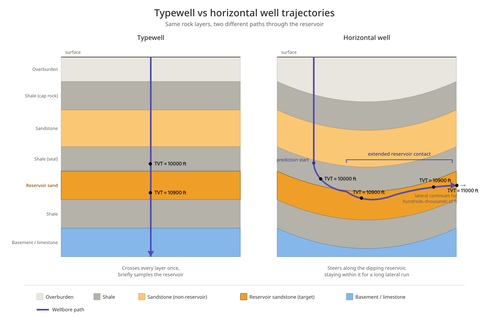
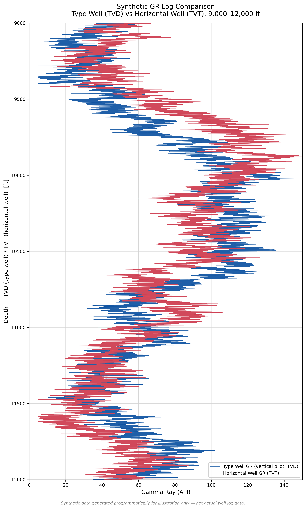

# ROGII - Wellbore Geology Prediction
Machine learning solution for the Kaggle competition: ROGII - Wellbore Geology Prediction. Using Bidirectional LSTM, Hidden Markov Chains, Hierarchical Clustering, XGBoost and KNN

##  Competition
https://www.kaggle.com/competitions/rogii-wellbore-geology-prediction/

ROGII - Wellbore Geology Prediction
───────────────────────────────────

• Kaggle Competition: ROGII - Wellbore Geology Prediction  
• Tasks performed: Classification, Clustering, Regression  
• Models: Bidirectional Many-to-Many LSTM (RNN), Hidden Markov Chains, Hierarchical Clustering, XGBoost and KNN  
• Validation set is comprised of 10% of training data (10% of the wells).  
• Hyperparameter tuning of XGBoost and KNN is done with 4-fold Cross Validation using GridSearchCV

## Table of Contents

- [Competition Description](#Competition Description)
- [Competition Files and Field Description](#Competition Files and Field Description)
- [Programming Languages](#Programming Languages)
- [Python Modules](#Python Modules)
- [Solution Overview](#Solution Overview)
- [Solution Performance](#Solution Performance)
- [Notebook Structure](#Notebook Structure)

## Competition Description
This competition is about the modelling of the drilling of a horizontal well. Drilling a well is difficult as we never know where we are due to the geological layers curvature and overall irregular morphology. The goal is to stay on the target layer and not delve into the wrong one. The depth in the layer is described by a measure called TVT (True Vertical Thickness) in feet (ft).
The goal of the competition is to predict the value of TVT for each 1ft step of drill in the 3D coordinate system (X, Y, Z).
  We get 2 files per well drilled, one for the horizontal well and another for the respective typewell (vertical well), the reference well. 
On the vertical well, the travelling is done only across Z, and so we get the reference TVT and corresponding gamma ray (GR) signature values.
These GR values are a signal obtained during drilling that can be interpreted to understand "where we are" in the layers. We have GR values on both well files.
There's also additional info which refers to the current layer at each step, though this exists for training files only.

  
AI-generated illustration with Claude Sonnet 5 (with manual modifications)
 
 

      
     
    <em>AI-generated illustration with Claude Sonnet 5</em>

## Competition Goal
Currently geologists estimate the current TVT value manually using their technical knowledge and the ROG II company software, the goal of the competition is to produce an ML or AI solution that does it automatically, minimizing the Root Mean Square Error (RMSE) associated with TVT prediction, this being the evaluation metric of the competition.  

$$
RMSE = \sqrt{\frac{1}{n}\sum_{i=1}^{n}(y_i-\hat{y}_i)^2}
$$
 
## Competition Files and Field Description

The files access is restricted to the competition, so instead the notebook is presented here with the results of its execution, hiding the raw information.

As per stated in the competition:

Folder: train/  
Wells: 776   
Contains the training data. Each well has three associated files:

{WELLNAME}__horizontal_well.csv - Trajectory, geological surfaces, and log data.
- WELLNAME - unique identifier for the well.
- MD - Measured Depth (ft): The total length of the wellbore from the surface.
- X - Easting (ft): Spatial coordinate in the horizontal plane.
- Y - Northing (ft): Spatial coordinate in the horizontal plane.
- Z - True Vertical Depth (ft): The vertical distance below sea level.
- ANCC, ASTNU, ASTNL, EGFDU, EGFDL, BUDA - Predicted depth of various geological formations (Training only).
- TVT - True Vertical Thickness (ft): The manually interpreted geological position for each 1 ft of the lateral well. This is the target variable (Training only).
- GR - Gamma Ray (API): Log measuring natural radioactivity of the rock.
- TVT_input - Input Target (ft): A copy of TVT provided as a feature. This column contains NaN values for the evaluation zone.  

{WELLNAME}__typewell.csv - Vertical reference log for geological correlation.
- TVT - Vertical Depth Index (ft): Primary depth reference for the vertical log. Corresponds to TVT (geological position) of the associated horizontal well.
- GR - Gamma Ray (API): The vertical Gamma Ray signature used for correlation.
- Geology - Formation Label: Categorical label indicating the geological unit (e.g., EGFDL, BUDA). (Training only)

{WELLNAME}.png - Visualization of the well path and geological cross-section. (no new info, just for visualization)

Folder: test/   
Wells: 3 / 200  
Contains the evaluation data for 3 wells publicly, and about 200 wells privately. Each well has two associated files:

{WELLNAME}__horizontal_well.csv - Trajectory and log data. In these files, the TVT target is hidden (replaced with NaN) in the evaluation zone.

{WELLNAME}__typewell.csv - Vertical reference log for the test well.

sample_submission.csv - A sample submission file in the correct format.
- id - A unique identifier for each prediction point, formatted as {WELLNAME}_{row_index} (e.g., 015fe0d2_1654).
- tvt - Your predicted True Vertical Thickness (ft).

## Programming Languages
- Python 3

## Python Modules
- pytorch
- scikit-learn
- xgboost
- hmmlearn
- scipy
- numpy
- numba
- pandas

## Solution Overview
This solution is structured in the following way:
- First we make use of the fact that layers are known for training typewells, and so we train a model to perform layer classification (multiclass). Prior to that we do a load of all the files and perform all necessary cleansing, and feature engineering.  
 For this model 126 features are created/engineered by computing windowed stats on the typewell's GR values.  
 These features have multicollinearity between themselves but we're able to extract their unique info through the RNN, more specifically a Bidirectional Many-to-Many LSTM is used.  
 During inference this model is used to determine the geological layers of the test typewells.

      
     
    <em>AI-generated illustration with Claude Sonnet 5</em> 

- After the classification is done, there will be be slight irregularities, as some rows will have an incorrect layer prediction, for instance, naming the layers by their index, from 0 to 6, we could have:  
...000011111511...222222..., it's possible to notice here that here we're having a layer "5" assigned ahead of time in the middle of layer 1.  
 We correct this by applying another model, a Hidden Markov Chains model. This will clean these inconsistencies as we set the transition probabilities of going backwards in layer number to zero.  
So the sequence becomes consistent:

    <em>...000011111511...222222...  -->  ...000011111111...222222...</em> 

- After getting the layers, some of the typewells will still not be ready to be used to assist on the TVT prediction of the horizontal well as their TVT range is shorter than what's necessary.  
 So we need to find the most similar wells and copy the "chunk" of TVT vs GR info that we need to patch up the incomplete well. This is done by creating new layer-based features, and finding the necessary wells through Hierarchical Clustering.

      
     
    <em>AI-generated illustration with Claude Sonnet 5 (with manual modifications)</em> 

- Finally we perform the horizontal TVT training and prediction. Uncommonly for ML workflows the training of these regression models is done at prediction time incrementally at each point.  The reason for this is tied with the sequential and algorithmic nature of the problem, which leads to having a much higher reduction of the RMSE this way (at least for the models used) then doing all in one go.
  This may look hefty but KNN requires no training so it takes no time, and incrementally we get to be able to use the lag1 TVT prediction result to guess the "navigation" for the current point. 
  The other ML model being used is XGBoost, that has very fast training which makes it feasible with this approach. 
  It's important to note that hyperparameter tuning is actually only done once per each model type at the beginning of predictions for each well. 
  The third component of the prediction is an algorithm that compares the current horizontal step GR value and lag1 TVT against the typewell data. This is done by creating a lookup window to the typewell data a window that stretches from the lag1 TVT plus a margin value used for both up and down of that point on the typewell. Then we take the average of those TVT values to guess the current horizontal TVT, but those TVT values are multiplied by weights that are determined by how close the corresponding GR value is to the current horizontal step GR value. So we get a pondered TVT to help us guess where we stand in the drill. The obtained increment that this represents against the previous TVT value (lag1) is then divided by F*M. Where M is the margin that was used in the window in feet (ft), and F is a margin factor that is essentially the fraction that we multiply the margin for in this division. This approach to the algorithm is the one that resulted in the highest reduction on RMSE.
  The prediction is done following the formula:
$$
y_{pred} = 0.92 * KNN_{pred} + 0.05 * XGB_{pred} + 0.03 * GR\text{-}M50F2_{pred}
$$
 

## Solution Performance
This solution scored an RMSE of 14.337 on the competition. The solution that ended up winning the competition scored an RMSE of 5.639. The winner, as well as a large portion of the contestants seem to have used a Particle Filter model (also called a Sequential Monte Carlo (SMC) method).  
Unfortunately, I ended not exploring this for lack of time, so I don't know how this would blend into my solution, but it remains as a possible challenge for the future.

## Notebook Structure
The summarized structure of the notebook is the following:

#### Imports

#### Initial Configurations

#### Functions & Classes

- EDA Functions
- Preprocessing and Cleanup Functions
- Feature Engineering Functions
- Evaluation Functions
- Training Functions
- Training Classes

#### Main (Training)

- 1st Training Preprocessing
- Typewell Layer Training
- 2nd Preprocessing
- Horizontal TVT Training

#### Main (Inference)

- 1st Prediction Preprocessing
- Typewell Layer Prediction
- 2nd Prediction Preprocessing
- Horizontal TVT Prediction